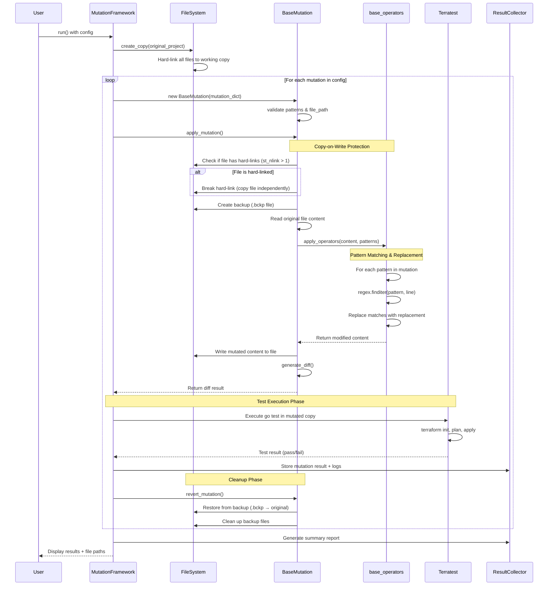
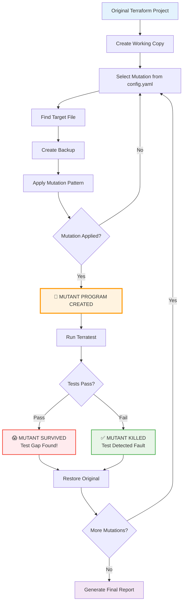
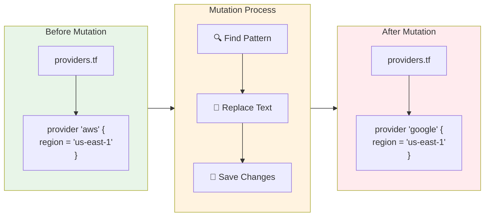

# Terramutate: Terraform Mutation Testing Framework

Terramutate is an open-source framework that **generates, applies, and evaluates mutation operators for Terraform configurations**. It leverages [Terratest](https://terratest.gruntwork.io/) to execute integration tests against mutated infrastructure and produces a detailed report for each operator.

## Key Features

1. **Automatic Project Backup**
   * The original Terraform project is copied to a working directory before any modification.
   * The backup is immutable; all mutations occur in the working copy, preserving the original code base.

2. **Library of Mutation Operators**
   * Operators are declared in `config/config.yaml` and grouped by category (e.g., *provider*, *resource*, *attribute*).
   * The framework dynamically loads every operator class, identified by its index, and invokes it during the test cycle.

3. **Isolated Execution per Mutation Index (idx)**
   * For each operator index (`idx`), the framework creates a **dedicated mutated program** (a separate copy of the project plus the applied change).
   * This design ensures that side-effects from one mutation do not influence another.

4. **Resource-Aware Test Strategy**
   * Copies share unchanged files through **symbolic links** where supported, lowering disk usage.
   * Tests run sequentially by default to minimise peak RAM consumption; a parallel mode can be enabled when resources allow.

5. **Terratest Integration**
   * Uses Go's `go test` command to execute existing Terratest suites.
   * Captures standard output and error streams for every mutation in timestamped log files.

6. **Comprehensive Reporting**
   * After the full cycle, a summary lists each mutation, its pass/fail status, and the path to its test log.
   * Detailed JSON reports can be enabled for downstream analysis.

## Project Structure

```text
.
├── app
│   ├── config
│   │   ├── config.json      # paths to IaC and tests
│   │   ├── config.yaml      # mutation operator catalogue
│   │   └── loader.py        # configuration loader
│   ├── mutations            # operator implementations
│   ├── framework.py         # orchestration logic
│   ├── main.py              # CLI entry-point
│   └── ...
├── tests                    # unit tests for the framework
└── README.md
```

## Installation

Prerequisites: **Python 3.11+**, **Go 1.15+**, **Terraform**, **Terratest**, **AWS CLI**, **LocalStack**.

```bash
# 1. Clone the repository
$ git clone https://github.com/asunnya/terraform-mutation.git
$ cd terraform-mutation

# 2. Set up a virtual environment
$ python -m venv .venv
$ source .venv/bin/activate
$ pip install -r requirements.txt

```

## Configuration

### `config.json`
Defines paths relative to the project root:

```json
{
  "terraform_paths": {
    "root_folder": "app/infrastructure/",
    "infrastructure_folder": "app/infrastructure/",
    "test_folder": "tests/"
  }
}
```

### `config.yaml`
This file controls which mutation operators are available during a run and how they should be filtered.

```yaml
# Global settings
mutation_mode: "individual"               # or "categorized"
include_categories: [VCR, IPR, IVR, PDR]  # optional subset selection
include_mutation_types:
  - VCR_3_tilde_gt_to_gte
  - IPR_ACT_WC
  - PDR_NAME_REPLACE

# Operator catalogue
mutations:
  # ---------------------------------------------
  # Version-Constraint Replacement (VCR)
  # ---------------------------------------------
  - category: VCR
    file_type: version_constraint
    mutation_type: VCR_3_tilde_gt_to_gte
    patterns:
      - pattern: "(?i)version\\s*~>\\s*"
        replacement: "version >= "
    id: vcr_3_tilde_gt_to_gte

  # Provider Declaration Replacement (PDR)
  - category: PDR
    file_type: provider
    mutation_type: PDR_NAME_REPLACE
    patterns:
      - pattern: '(?i)provider\\s*"aws"'
        replacement: 'provider "google"'
    id: pdr_name_replace
```

## Usage

```bash
python app/main.py <terraform_project_path> <config.json> [config.yaml]
```

Arguments:
* `<terraform_project_path>` – Path to the Terraform project you wish to test.
* `<config.json>` – Path to the JSON configuration file shown above.
* `<config.yaml>` – Optional path to the YAML operator catalogue (defaults to `app/config/config.yaml`).

### What Happens Internally

1. The project is **copied** to a working directory (`<project>_mutated_copy`).
2. For each operator `idx`:
   * A fresh copy of the working directory is created (using hard links or symlinks to save space).
   * The operator modifies the relevant `.tf` file(s).
   * `go test` executes the Terratest suite.
   * The mutation is reverted and logs are stored in `tests/<OperatorName>_output.txt`.
3. After all operators have run, a concise report is printed to stdout and written to disk.

## Performance Guidelines

* **Storage efficiency** – Unchanged files are linked, not duplicated, which reduces disk usage for large Terraform projects.
* **Memory footprint** – Tests execute sequentially unless `--parallel` is specified, preventing excessive RAM usage.
* **Execution time** – Failed mutations abort early; the framework proceeds to the next operator without waiting for the full test duration when possible.

## Example Output

```text
Applying mutation vcr_3_tilde_gt_to_gte__idx0
Mutation applied to providers.tf
Tests complete – status: SUCCESS (alive)
Logs: research_results/vcr_3_tilde_gt_to_gte__idx0_output.txt

Applying mutation pdr_name_replace__idx0
Mutation applied to providers.tf
Tests complete – status: FAILED (killed)
Logs: research_results/pdr_name_replace__idx0_output.txt

Applying mutation rcr_sg_cidr_up__idx0
Mutation applied to security-group.tf
---DIFF START---
-cidr_blocks = ["0.0.0.0/0"]
+cidr_blocks = ["0.0.0.0/0"]
---DIFF END---
Tests complete – status: SUCCESS (alive)
Logs: research_results/rcr_sg_cidr_up__idx0_output.txt

... 5 more mutations processed ...

Summary
--------
Total mutants tested : 8
Killed (tests failed): 2
Alive  (tests passed): 6
Full report written to research_results/mutation_results_summary.txt
```

## Research Results Snapshot

The directory `research_results/` contains artefacts generated by running Terramutate against a sample Terraform project. A condensed excerpt is shown below:

```text
==================== Mutation Results ====================
Total mutant programs generated & tested: 8
• Killed (tests failed): 2
• Survived (tests passed): 6

[1] vcr_3_tilde_gt_to_gte__idx0   —  alive
[2] pdr_name_replace__idx0        —  killed
[3] rcr_sg_cidr_up__idx0          —  alive
[4] rcr_sg_cidr_up__idx1          —  alive
[5] rcr_sg_from_up__idx0          —  alive
[6] rcr_sg_from_up__idx1          —  alive
[7] rcr_sg_to_up__idx0            —  alive
[8] rcr_sg_to_up__idx1            —  killed
===========================================================
```

Interpretation:
* **Killed** mutants indicate that the test suite detected the injected fault, signalling adequate coverage for that mutation pattern.
* **Alive** mutants reveal gaps where the current tests did not fail; these cases inform where additional assertions may be required.

For each entry the framework stores:
1. A unified diff between the original and mutated Terraform file (`*.bckp` vs current).
2. The full Terratest output in `research_results/<MutantName>_output.txt`.

These artefacts facilitate manual inspection and automated analytics of mutation effectiveness.

## Internal Test Suite

The `tests/` directory ships with 30 automated unit tests written with **pytest**. Key areas covered include:

| Module                               | Purpose                                             |
|--------------------------------------|-----------------------------------------------------|
| `test_base_mutation.py`              | Validates mutation lifecycle (apply / revert).      |
| `test_mutation_framework.py`         | Exercises framework orchestration and reporting.    |
| `test_selection_filter.py`           | Ensures category/type filters operate correctly.    |
| `test_granular_mutation.py`          | Verifies fine-grained mutation occurrence handling. |
| `validation_research/`               | Regression tests for multi-file and variant cases.  |

Run all tests locally with:

```bash
pytest -q
```

Continuous integration can invoke the same command to guard regressions as new operators are added.

## Architecture Overview

The following component diagram illustrates the core components and their relationships in Terramutate:

```mermaid
graph TD
    subgraph Framework[Terramutate Framework]
        
        subgraph Entry[Entry Point]
            CLI[main.py<br/>CLI Args & Validation]
        end
        
        subgraph Core[Core Framework]
            MF[MutationFramework<br/>Orchestration<br/>Copy Creation<br/>Test Execution]
        end
        
        subgraph Config[Configuration]
            JSON[config.json<br/>Terraform paths]
            YAML[config.yaml<br/>Mutation operators]
            Loader[Config Loader]
        end
        
        subgraph Engine[Mutation Engine]
            Base[BaseMutation<br/>apply revert show_diff]
            Ops[base_operators<br/>Pattern matching]
            
            subgraph Types[Mutation Types]
                VCR[VCR<br/>Version Constraints]
                PDR[PDR<br/>Provider Declaration] 
                RCR[RCR<br/>Resource Config]
                IPR[IPR<br/>IAM Policy]
                IVR[IVR<br/>Input Variables]
                SAR[SAR<br/>Static Analysis]
            end
        end
        
        subgraph Test[Test Integration]
            FS[File System<br/>Copy & Backup]
            TT[Terratest<br/>Go Test Execution]
        end
        
        subgraph Output[Output & Analytics]
            Console[Console Output]
            Files[Result Files]
        end
        
    end
    
    subgraph External[External Dependencies]
        TFCLI[Terraform CLI]
        TTLIB[Terratest Library] 
        GO[Go Runtime]
    end
    
    CLI --> MF
    MF --> JSON
    MF --> YAML
    Loader --> JSON
    Loader --> YAML
    MF --> Base
    Base --> Ops
    Base --> VCR
    Base --> PDR
    Base --> RCR
    Base --> IPR
    Base --> IVR
    Base --> SAR
    MF --> FS
    MF --> TT
    MF --> Console
    MF --> Files
    TT --> TFCLI
    TT --> TTLIB
    TT --> GO
    
    classDef entry fill:#e1f5fe,stroke:#01579b,stroke-width:2px
    classDef core fill:#f3e5f5,stroke:#4a148c,stroke-width:2px
    classDef config fill:#e8f5e8,stroke:#1b5e20,stroke-width:2px
    classDef mutation fill:#fff3e0,stroke:#e65100,stroke-width:2px
    classDef test fill:#fce4ec,stroke:#880e4f,stroke-width:2px
    classDef output fill:#f1f8e9,stroke:#33691e,stroke-width:2px
    classDef external fill:#ffebee,stroke:#b71c1c,stroke-width:2px
    
    class CLI entry
    class MF core
    class JSON,YAML,Loader config
    class Base,Ops,VCR,PDR,RCR,IPR,IVR,SAR mutation
    class FS,TT test
    class Console,Files output
    class TFCLI,TTLIB,GO external
```



### Key Design Patterns

- **Strategy Pattern**: Different mutation types (VCR, PDR, RCR, etc.) implement the same `BaseMutation` interface
- **Template Method**: `MutationFramework.run()` defines the execution flow, delegating specifics to mutation implementations  
- **Command Pattern**: Each mutation encapsulates an operation that can be applied and reverted
- **Copy-on-Write**: Efficient file management using hard links, breaking them only when mutations are applied

## Mutation Process Flow

### Detailed Technical Process

The following sequence diagram shows the internal process of how a single mutation transforms a Terraform project into a mutant program:



### Simplified Overview

The following diagram shows how Terramutate transforms a normal Terraform project into a mutant program:



### Simple Example: Provider Mutation

Here's what happens when we apply a **PDR_NAME_REPLACE** mutation:



### What Makes It a "Mutant Program"?

1. **Single Change**: Only one specific pattern is modified per mutant
2. **Isolated Copy**: Each mutation runs in its own workspace
3. **Testable**: The mutated code can be executed and tested
4. **Reversible**: Original code remains untouched

This creates a **controlled experiment** where we can measure if our tests detect the introduced fault.

## License

This project is released under the [MIT License](LICENSE).

